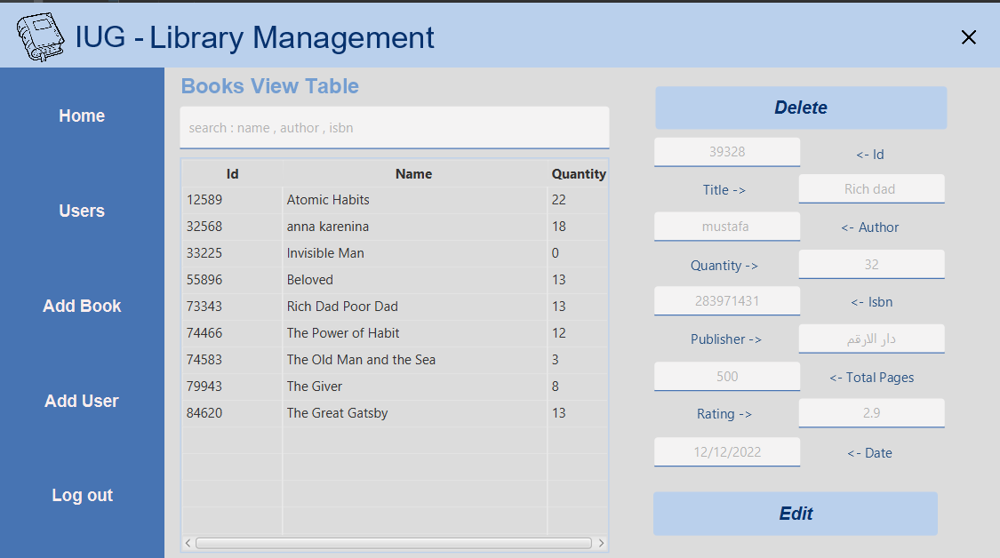
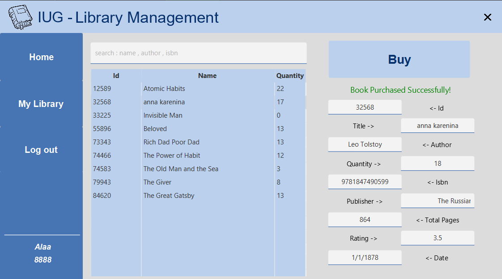

<h1 align="center">Library Management System</h1>
<h3 align="center"> This Project is part of Days and Days of work 
even though is not in it's last version yet but we Done 100% of the Back End work and most of the styling, and Inshallah in the project Discussion will be in its most modern, stylesh, stable version.written with all❤             <h5>                 Belal   </h5>      </h3>
<h1></h1>

  

## Preview

  

## AdminUI

  

## UserUI

  

# 🛠 Written Preview

this is high respnose offline fast stable software to make easier for the librarys normals users and the libraryans themselfs, 
its A library management System to manage the users-Admin relations with buying book etc with high efficient search for the books and for users 
and its come with easy of use for the users and even for the admin.

Doing:
- [ ] Store all the possible data of the books like name isbn author etc 
- [ ] Store all the possible data of users like name email age etc 
- [ ] give a user-books relation between the uesrs and the books they purchased
- [ ] make the possibility for users/admin to search for any keyWord they want 

Warning ! .. this is brief Explanation for what we did and worked on , as a reader you should see the source code the get the bigger picture thank you.

# 📑 Techincal Contents

<!-- TOC -->
<h4>We used with this program fast dataStructers in searcing , adding , getting and editing data </h4>

***Important ::: note that the admin userId->1111 and the password->admin

* [📑 We have two Interfaces one for users and one for Admin and  ofcourse the login/Singup interface.](#-)

* [💻 We used slideBars for swtiching between panes with cool methods. ](#-)

* [💻For the users and the Books objects we used TreeMaps.](#-)

* [📑HashMap with (key,value)->(Integer,LinkedList<>) to make a relation between users and the books they purchased.](#)
* [💻we dont have the ability to use real Database so we used files with txt csv extensions to make it through, of course we are not reposible of the high complexitiy of writing and reading the data but for but for normal get methods its O(logn) :) ](#)

* [📑For the search algorithm we have two complexitys for this cuz the different of the looking for data and when searching with id its log(n ) but for wen serching with (Strings) its O(n) :(  ](#)

* [💻We dealed with the Main structers (user/books treeMaps and Hashmap) as A statics so we can invoke them in classes out of the RWDatabase class for make it easy on us. and there is refreshing reading/writing methods](#)
        
# 💻 Environment

This lib is a compnent for JavaFx:   [JavaFx](https://openjfx.io/)

We have a great workstation here, then I've using a maven  and Java and JavaFx +19 on Windows. (I really want to test in other systems in future).

# 🚀 WorkFlow

We split the work between us Eng.Baraa  take most of main interfaces and the book/users objects and the add/remove user/book cnotrollers structer.
And I Eng.Belal was working on the Search algorithms and tableViews details and the ui/ux styling and displaying the content of the right side panels and editing them.

should we mention that we used Git with our work, github make it easy to code without even see each oter it was really game changing and alot of skills we learnt in this chapter of out lifes.
to see the public Github repository [gitHub](https://github.com/62656c616c412e/LibraryManegmentSystem)

Best regards 

Belal A. Thabet 120203079 belalth4real@gmail.com

Baraa M. Shaat  120200652 baraashaat144@gmail.com

  

